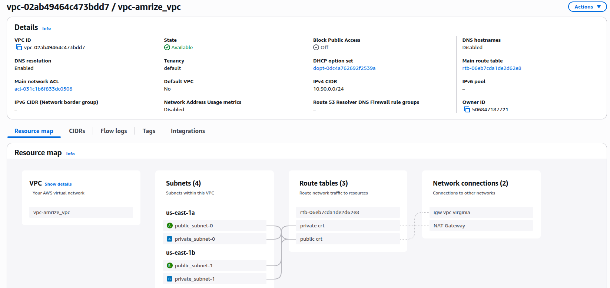
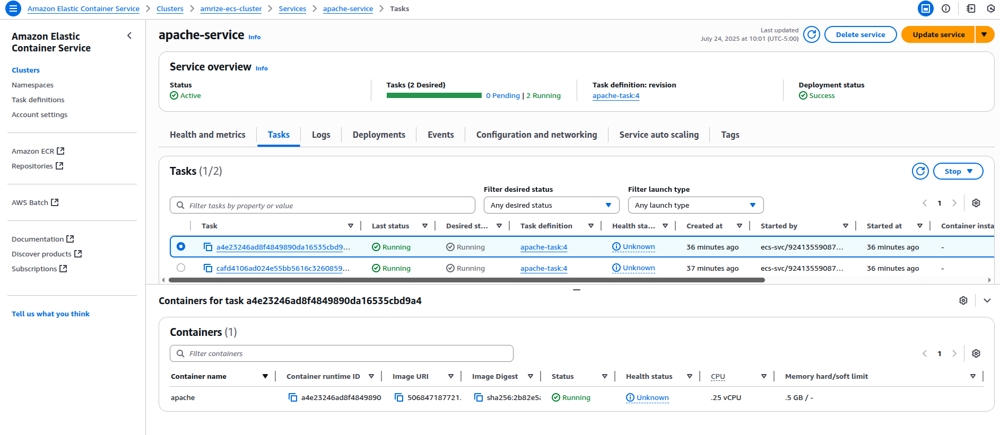
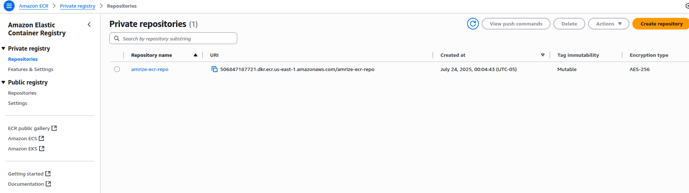
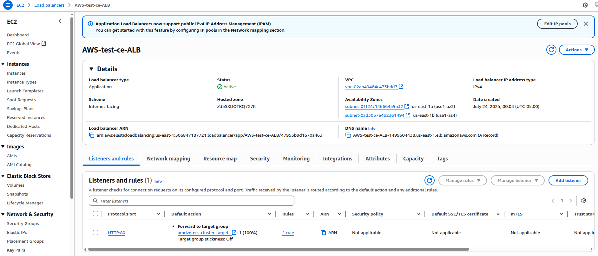
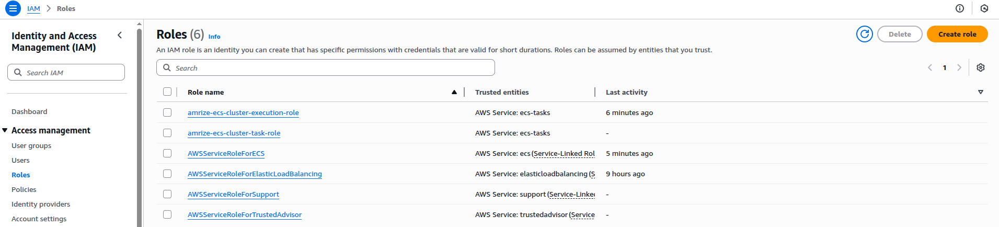
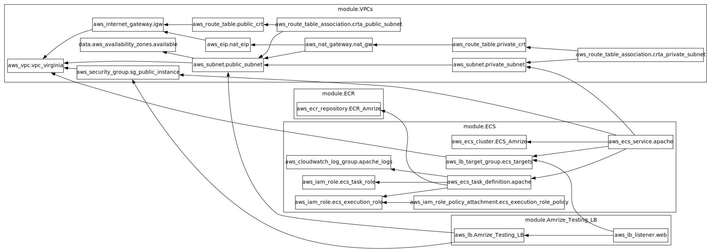

# Amrize Infrastructure Project

Este proyecto contiene la infraestructura como código (IaC) para el proyecto Amrize como prueba técnica de Alejandro Higuita, fue implementado usando módulos creados manualmente se Terraform en AWS y una pequeña imagen en apache con un texto plano en HTML para demostrar el sitio funcionando.

Por el momento se no se usaron buckets S3 para guardar el terraform state, sin embargo sí se ocultaron de commit para evitar filtraciones de información.


Esta fue la infra Solicitada en su momento.


## Descripción

La infraestructura incluye:

- **VPC**: Red privada virtual con subnets públicas y privadas

- **ECS**: Cluster de contenedores para ejecutar aplicaciones

- **ECR**: Registro de contenedores de Docker

- **ALB**: Application Load Balancer para distribución de tráfico

- **IAM**: Roles y políticas para servicios de AWS


-   **Grafico de dependencias** : Finalmente, agrego un pequeño gráfico de dependencias creado desde terraform.



## Estructura del Proyecto

```
.
├── main.tf                    # Configuración principal
├── variables.tf               # Variables de entrada
├── outputs.tf                 # Valores de salida
├── terraform.tfvars          # Valores de las variables (no incluido en Git)
├── Dockerfile                # Imagen de contenedor Apache
└── Modules/
    ├── VPC/                  # Módulo de red
    ├── ECS/                  # Módulo de contenedores
    ├── ECR/                  # Módulo de registro
    └── APP_Load_Balancer/    # Módulo de load balancer
```

## Prerrequisitos

- Terraform >= 1.0
- AWS CLI configurado
- Credenciales de AWS con permisos apropiados

## Uso

1. **Clonar el repositorio:**
   ```bash
   git clone <repository-url>
   cd Amrize_validated
   ```

2. **Configurar variables:**
   ```bash
   cp terraform.tfvars.example terraform.tfvars
   # Editar terraform.tfvars con tus valores
   ```

3. **Inicializar Terraform:**
   ```bash
   terraform init
   ```

4. **Validar la infraestructura:**
   ```bash
   terraform validate
   ```
5. **Planificar la infraestructura:**
   ```bash
   terraform plan
   ```

6. **Aplicar la infraestructura:**
   ```bash
   terraform apply
   ```

## Recursos Creados

- VPC con subnets públicas y privadas
- ECS Cluster con Fargate
- ECR Repository
- Application Load Balancer
- Security Groups
- IAM Roles y Policies

## Outputs

Después del deployment, obtendrás:

- `alb_url`: URL del Application Load Balancer
- `ecr_repository_url`: URL del repositorio ECR
- `ecs_cluster_name`: ARN del cluster ECS
- `vpc_id`: ID de la VPC creada

## Limpieza

Para destruir la infraestructura:

```bash
terraform destroy
```

## Contribuir

1. Fork el proyecto
2. Crea una rama para tu feature (`git checkout -b feature/nueva-funcionalidad`)
3. Commit tus cambios (`git commit -am 'Agregar nueva funcionalidad'`)
4. Push a la rama (`git push origin feature/nueva-funcionalidad`)
5. Crea un Pull Request

## Posibles mejoras

A continuación desde mi perspectiva, voy a listar unas posibles mejoras sobre la infraestructura en caso de que fuera un ambiente productivo.

1.  En primer lugar pondría un WAF con protección DDoS antes de load balancer, de esta manera tendía la protección de un Firewall como capa perimetral.
2.  Como existiría un WAF, haría cambios en el Security Group, permitiendo únicamente las IPs que provienen del WAF y así no se podría apuntar hacia el DNS del ALB directamente.
3.  Para el manejo de almacenamiento en caso de que la aplicación lo requiriera, usaría un S3 con encripción para conectarlo hacia el ECS y así poder tener la data abstraída del cluster.
4.  En caso de tener una base de datos, tenerla en un VPC diferentes y con Peering Connection, adicional un Security group con los segmentos autorizados y únicamente los puertos necesarios.
5.  Habilitaría estrategias de Backup como políticas de retención de imágenes en el lifecicle del ECR y versioning automático de las imagenes en el ECS.
6.  Importante tener un sistema de monitoreo que permita ver el estado de las tasks.
7.  Obviamente los repos de despliegue no serían públicos.
8.  Para garantizar la fibilidad de las imagenes desplegadas en el ECR, habilitaría un sistema de encripción.
9.  Para este ejercicio en particular, se crearon roles un poco Amplios, sin embargo sería también muy importante limitarlos a la política de mejor prilegio posible.

## Autor

- **Alejandro Higuita** - [hahiguit](https://github.com/hahiguit)
